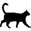
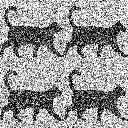
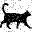
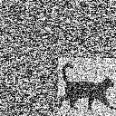
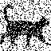
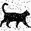
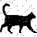
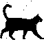

## Repeat-Accumulate Error Correction Code Example

Repeat-Accumulate error correction code is a flavor of LDPC with very simple encoder. Despite simplicity, it still approaches the theoretical Shannon limit.

In this toy example we will be transmitting the following 64x64 black and white image:

Most real data will have less redundancy, but here redundancy is good because it will help see the errors.

As a baseline, try simplest possible error correction first: send the same data four times. To simulate channel noise, pull random numbers from normal distribution and add to the transmitted signal. In this example signal to noise ratio is kept at pretty sporty 2 dB.

On the receiving end, average received copies to recover the original:

There are still 148 bits that flipped. Not great. Enter the Repeat-Accumulate algorithm:

* Repeat each input bit *Q* times

* Apply a random (but fixed) permutation, the same for each codeword. Receiver will need to know this permutation to decode

* Transmit running total of the permuted bits, modulo 2. If bits are *b1*, *b2*, *b3*, etc. then we will send *b1*, then *b1&oplus;b2*, then *b1&oplus;b2&oplus;b3*, and so on.

Here it is used as a systematic code with *Q=3*, so first 64x64x3 bits go through the above logic, and the last 64x64 bits contain a copy of the orginal. Here is the transmitted message after adding exactly the same noise as in the first example:

The decoding algorithm is iterative. Below are the intermediate results.

The decoding algorithm is borrowed from LDPC codes. It's using passing messages back and forth on Tanner graph, in a way similar to Viterbi algorithm.
