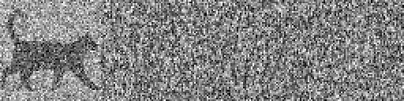
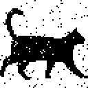

## Repeat-Accumulate Error Correction Code Example

Repeat-Accumulate error correction code is a flavor of [LDPC](https://en.wikipedia.org/wiki/Low-density_parity-check_code) with very simple encoder. Despite simplicity, it still approaches the theoretical [Shannon limit](https://en.wikipedia.org/wiki/Noisy-channel_coding_theorem).

In this toy example we will be transmitting the following 64x64 black and white image (scaled up 2x for clarity), column by column, from left to right:

Most real data will have less redundancy, but here redundancy is good because it will help see the errors.

As a baseline, try simplest possible error correction first: send the same data four times. To simulate channel noise, pull random numbers from normal distribution and add to the transmitted signal. In this example signal to noise ratio is kept at pretty sporty 1 dB.

On the receiving end, sum log likelihood ratios for each received bit to recover the original:

There are still over two hundred bits that flipped. Simple averaging works about the same. Not great.

Enter the **Repeat-Accumulate algorithm**:

* Repeat each input bit *Q* times

* Apply a random (but fixed) permutation, the same for each codeword. Receiver will need to know this permutation to decode

* Transmit running total of the permuted bits, modulo 2. If bits are *b1*, *b2*, *b3*, etc. then send *b1*, then *b1&oplus;b2*, then *b1&oplus;b2&oplus;b3*, and so on

In this example RA code is used as a systematic code with *Q=3*. First 64x64 transmitted *data bits* contain a copy of the orginal, followed by 64x64x3 *parity bits* that were created using the above logic.

Instead of sending all parity bits, it's possible to send every *A*th parity bit, with little change in decoding logic, but in this example *A=1*.

Here is the transmitted message after adding exactly the same noise as in the first example:

Decoding algorithm is iterative. Intermediate results after 1, 10, 20, 30, 40 iterations, and final decoded image:

      

Decoding algorithm is borrowed from LDPC codes. It's using [passing messages](https://en.wikipedia.org/wiki/Belief_propagation) back and forth on [Tanner graph](https://en.wikipedia.org/wiki/Tanner_graph), in a way similar to [Viterbi algorithm](https://en.wikipedia.org/wiki/Viterbi_algorithm).

To build Tanner graph, start by noting that with *A=1* it is possible to get one original (permuted) bit by XORing two consecutive transmitted parity bits. For example, if *b1&oplus;b2* is followed by *b1&oplus;b2&oplus;b3*, then *(b1&oplus;b2)&oplus;(b1&oplus;b2&oplus;b3)=b3*. And if we XOR it with corresponding data bit, we should get a zero.

Similarly, if *A>1* then by XORing two censecutive parity bits we get XOR of *A* original (permuted) bits. And if we XOR that with corresponding data bits, we should again get a zero.

This allows to construct one parity check node for each parity bit. All parity check nodes have *A+2* inputs, except the first one that has *A+1* inputs (because first parity bit is transmitted as is).

In this simplified Tanner graph with three bits of data and *Q=2*, the squares at the top represent check nodes, and circles at the bottom represent variable nodes. Variable nodes correspond to transmitted bits and therefore are of two kinds: 

* *data bits* represented by white circles 0 through 2. Each data variable node has *Q* inputs, 
* *parity bits* represented by gray circles 3 through 8. Each parity variable node has two inputs, except the last one that only has one

The algorithm stops once all parity checks are satisfied (or we reach maximum number of iterations, which usually means that some errors cannot be corrected). At this point variable nodes contain best estimate of original bits.

More details on RA and other error correcting codes can be found [here](http://www.inference.org.uk/itprnn/book.pdf) (link goes straight to PDF).
