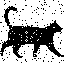

## Repeat-Accumulate Error Correction Code Example

Repeat-Accumulate error correction code is a flavor of [LDPC](https://en.wikipedia.org/wiki/Low-density_parity-check_code) with very simple encoder. Despite simplicity, it still approaches the theoretical [Shannon limit](https://en.wikipedia.org/wiki/Noisy-channel_coding_theorem).

In this toy example we will be transmitting the following 64x64 black and white image (scaled up 2x for clarity), column by column, from left to right:

Most real data will have less redundancy, but here redundancy is good because it will help see the errors.

As a baseline, try simplest possible error correction first: send the same data four times. To simulate channel noise, pull random numbers from normal distribution and add to the transmitted signal. In this example signal to noise ratio is kept at pretty sporty 1 dB.

On the receiving end, sum log likelihood ratios for each received bit to recover the original:

There are still over two hundred bits that flipped. Simple averaging works about the same. Not great.

Enter the **Repeat-Accumulate algorithm**:

* Repeat each input bit *Q* times

* Apply a random (but fixed) permutation, the same for each codeword. Receiver will need to know this permutation to decode

* Transmit running total of the permuted bits, modulo 2. If bits are *b1*, *b2*, *b3*, etc. then send *b1*, then *b1&oplus;b2*, then *b1&oplus;b2&oplus;b3*, and so on.

In this example RA code is used as a systematic code with *Q=3*. First 64x64x3 bits go through the above logic. We'll call them *parity bits*. The last 64x64 bits contain a copy of the orginal. We'll call then *data bits*.

Here is the transmitted message after adding exactly the same noise as in the first example:

Decoding algorithm is iterative. Intermediate results after 1, 10, 20, 30, 40 iterations, and final decoded image:

      

Decoding algorithm is borrowed from LDPC codes. It's using [passing messages](https://en.wikipedia.org/wiki/Belief_propagation) back and forth on [Tanner graph](https://en.wikipedia.org/wiki/Tanner_graph), in a way similar to [Viterbi algorithm](https://en.wikipedia.org/wiki/Viterbi_algorithm).

To build Tanner graph, start by noting that it is possible to get original (permuted) bit by XORing two consecutive transmitted parity bits. For example, if *b1&oplus;b2* is followed by *b1&oplus;b2&oplus;b3*, then *(b1&oplus;b2)&oplus;(b1&oplus;b2&oplus;b3)=b3*. And if we XOR it with *b3* data bit, we should get a zero. This way we can construct a parity check node for each parity bit. All parity check nodes will have three inputs, except the first one that has two inputs (because first parity bit is transmitted as is).

In this simplified Tanner graph with three bits of data and *Q=2*, the squares at the top represent check nodes, and circles at the bottom represent variable nodes.

Variable nodes are of two kinds: *parity bits* with two inputs (except the last one that has one input), and *data bits* with *Q* inputs. Here variable nodes 0 through 5 are parity bits, and 6 through 8 are data bits.

Once all parity checks are satisfied (or we reach maximum number of iterations, which usually means that some errors cannot be corrected), compare values held by variable nodes for data bits with zero to recover original bits.

Random interleaver has nice theoretical properties, *on average* and *in the limit*, but intuitively it's clear that not all random interleavers are equally good. For example, interleaver that does nothing is theoretically possible, albeit unlikely, and cannot be expected to work well because one would want the interleaver to avoid placing copies of the same bit close together.

One way to enforce this requirement is to use *S*-random interleaver, where no input symbols within distance *S* appear within a distance of *S* in the output, with *S = Q*. Instead of trying to construct such interleaver, the code in this example checks if randomly created interleaver is *S*-random, and keeps retrying with different seed if it is not. To save time, it starts with a known good seed that was found earlier.

More details on RA and other error correcting codes can be found [here](http://www.inference.org.uk/itprnn/book.pdf) (link goes straight to PDF).
